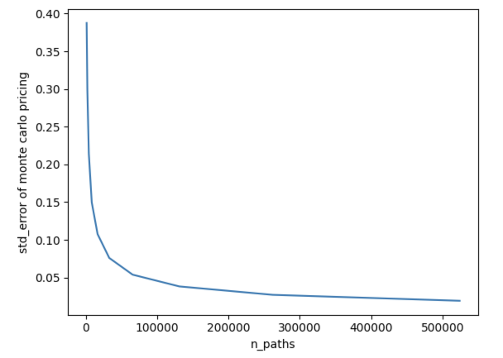
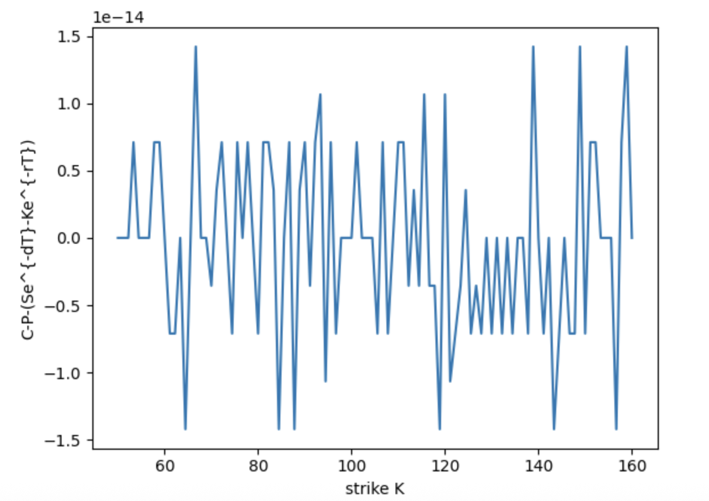
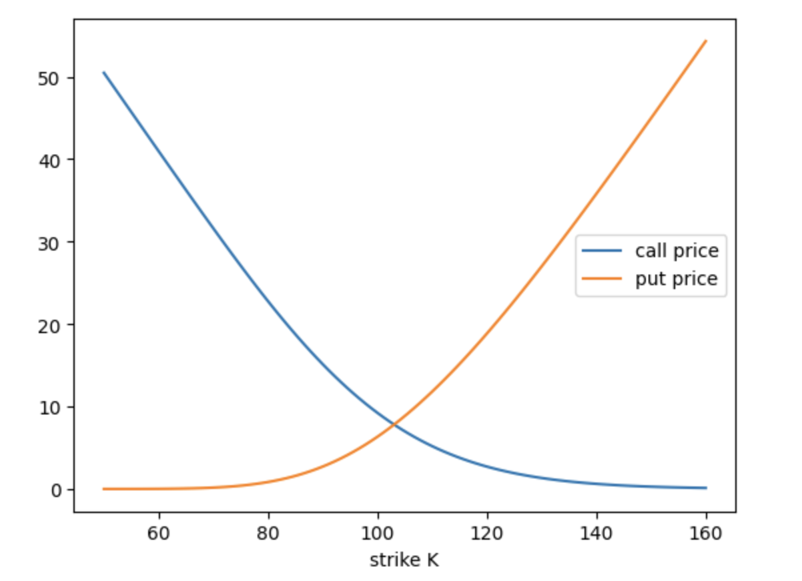
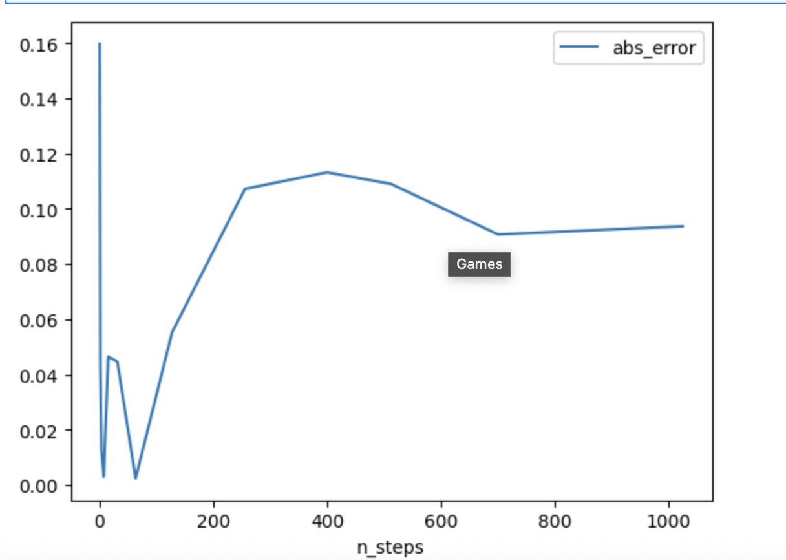
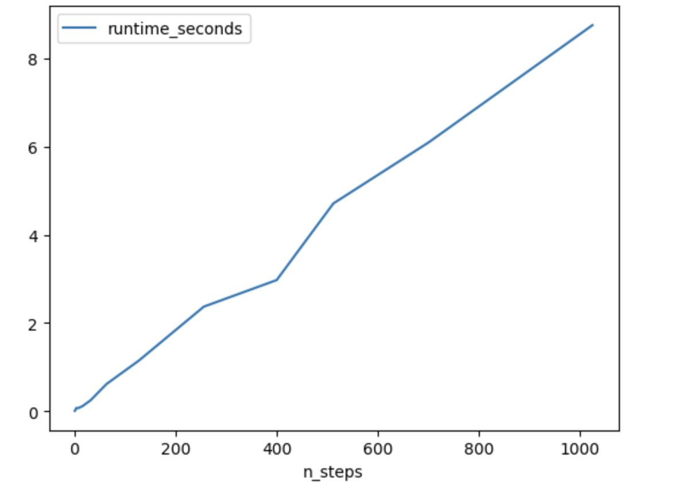

# Quant Pricing Engine

A modular Python framework for pricing financial derivatives using:

* Black-Scholes analytical pricing
* Monte Carlo simulation
* Numerical SDE discretization methods

The project focuses on quantitative validation, numerical convergence analysis, and simulation architecture commonly used in computational finance and quantitative development workflows.

---

# Features

## Analytical Pricing

* European call and put pricing
* Digital option pricing
* Black-Scholes closed-form formulas

## Monte Carlo Pricing

* Exact GBM terminal simulation
* Euler-discretized path simulation
* Variance and standard error estimation

## Validation & Numerical Analysis

* Black-Scholes vs Monte Carlo convergence analysis
* Put-call parity verification
* Monotonicity and convexity checks
* Digital option replication via call spreads (C(K+epsilon)-C(K))/epsilon
* Runtime vs accuracy benchmarking

---

# Project Goals

This project was built to explore:

* analytical derivative pricing
* stochastic simulation methods
* numerical discretization of SDEs
* Monte Carlo convergence behavior
* quantitative validation techniques

The implementation emphasizes:

* modular architecture
* reproducibility
* numerical correctness
* extensibility for future quantitative models

---

# Project Structure

```text
src/
├── black_scholes/
├── models/
│   ├── exact_gbm.py
│   └── path_gbm.py
├── options/
├── pricers/
├── random_numbers/
├── utils/
└── validation/

tests/

notebooks/
├── bs_vs_mc.ipynb
├── consistency_checks.ipynb
├── mc_convergence.ipynb
└── euler_vs_exact.ipynb
```

---

# Numerical Validation

## Monte Carlo Convergence

Monte Carlo pricing error decreases approximately at the expected:

O(N^{-1/2})

rate predicted by the Central Limit Theorem.

<p align="center">
  
</p>

---

## Put-Call Parity Validation

The implementation numerically verifies the put-call parity identity across a range of strikes:

C - P = Se^{-dT} - Ke^{-rT}

Residual errors remain near floating-point precision.

<p align="center">
  
</p>
<p align="center">
  
</p>

---

## Euler vs Exact Simulation

Euler-discretized GBM simulation is benchmarked against exact terminal-value simulation to study:

* timestep discretization error
* runtime scaling
* accuracy tradeoffs

<p align="center">
  
</p>

<p align="center">
  
</p>

---

# Environment Setup

## 1. Create Virtual Environment

```bash
python3 -m venv .venv
source .venv/bin/activate
```

## 2. Install Dependencies

```bash
pip install -r requirements.txt
```

## 3. Launch Notebook Environment

```bash
pip install jupyterlab
jupyter lab
```

---
